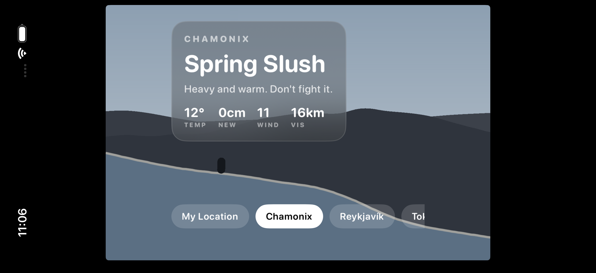
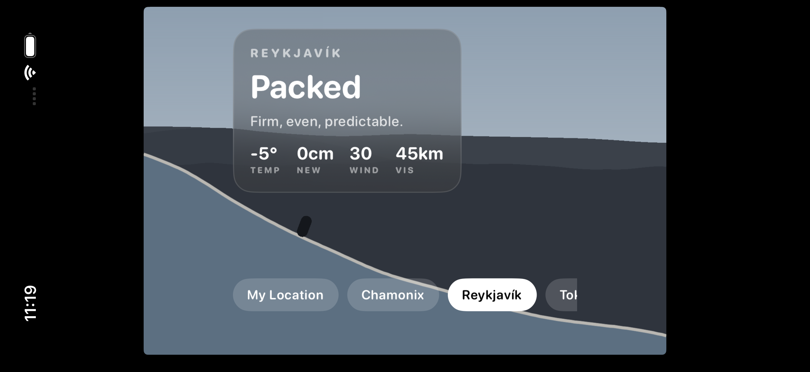
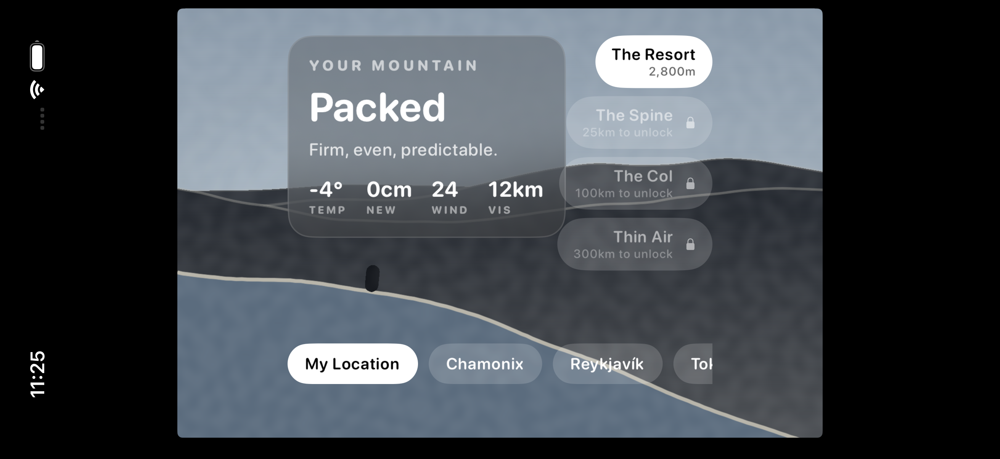
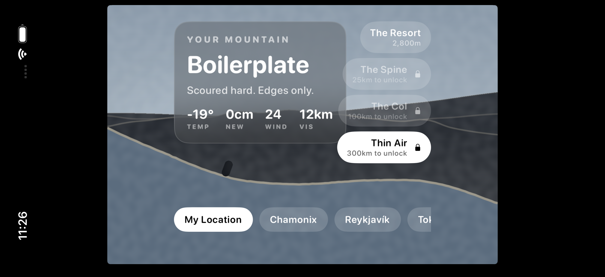
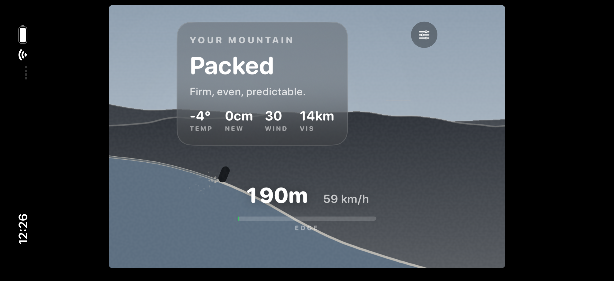
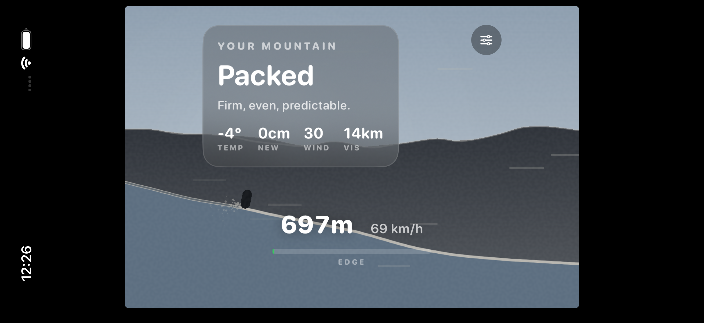
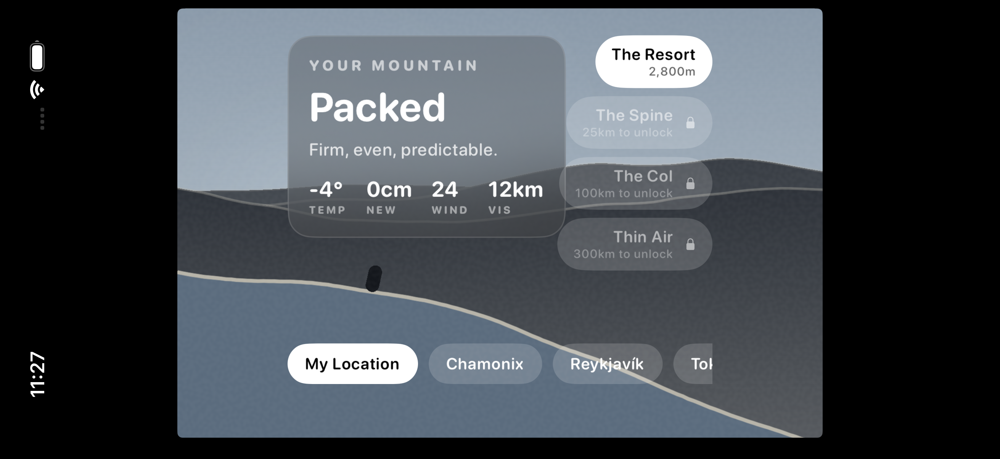

# Whiteout

**An endless alpine racer where your real local weather generates the physics.**

Not a filter over a ski game. Whiteout pulls live weather for your location, lifts that
atmosphere to 2,800 m, and derives an actual snowpack from it — then hands that snowpack to
the simulation. Fresh powder floats and forgives. Refrozen crust is fast and lethal.
Boilerplate has no grip at all. The same terrain seed plays like a different game across
conditions, and *what the correct decision is* changes with the weather outside your window.

iOS · Swift 6 · SpriteKit · 85 tests · in development

---

## How it works

```
Your real weather  →  lifted to alpine elevation  →  snowpack state  →  physics + palette + terrain
```

A player in Lagos has no local snow. Rendering their real weather would give them nothing —
a fatal reach problem hidden inside a clever idea. So Whiteout takes their *actual
atmosphere* and asks what it would be doing at altitude, using standard meteorology:
environmental lapse rate for temperature, a temperature-dependent snow-to-liquid ratio for
depth, a bounded power-law profile for wind. Everyone on Earth gets a real, personal,
materially different mountain day.

---

## The workflow, running

Every screenshot below is a real capture from the app running on an iPhone 17 Pro
simulator against **live Open-Meteo data**. No mockups, no seeded fixtures.

### 1. Live conditions — Chamonix, August



Launching with Chamonix selected. Real forecast at 2,800 m in August: **12 °C, spring
slush, 16 km visibility.** The conditions card is written in ski-report register, and the
snowpack it names is the one the physics is already using.

### 2. A different climate — Reykjavík



Switching origin re-resolves everything. **−5 °C, 30 km/h wind, 45 km visibility** —
arctic clarity, a different terrain seed, and a different sky computed from the same
palette function.

### 3. Altitude changes the game — the same weather at 2,800 m



Peaks unlock by distance skied. At The Resort, the player's real local weather resolves to
**−4 °C, packed** — "firm, even, predictable."

### 4. The same weather at 5,200 m



Identical weather, identical moment, 2,400 m higher: **−19 °C, boilerplate** — "scoured
hard, edges only." Thinner air also reduces drag, so this peak is genuinely faster and less
forgiving. Altitude is unlocked by play and never sold, precisely because it changes speed.

### 5. Playing — carving



Releasing the input carves: speed scrubs, spray comes off the edges, and the ski trail
records the line taken. **190 m at 59 km/h.** The EDGE meter tracks how close the skier is
to losing an edge.

### 6. Playing — tucked, flat out



Holding tucks: drag drops, speed lines stream, the silhouette compresses. **697 m at
69 km/h.** Instability is now filling — on this snowpack that is survivable, on boilerplate
it would already be over.

### 7. Generated atmosphere



No sky assets exist in this project. Every colour is computed in OKLCH from sun altitude,
cloud cover, precipitation and snow state, and aerial perspective dissolves distant ridges
in proportion to real visibility.

---

## Technical deep-dive

**The hardest decision was where to put the simulation.** `WhiteoutCore` imports no UI
framework at all — no UIKit, no SpriteKit. That looks like architectural fussiness until
you follow the consequences. The suite runs in **30 milliseconds with no simulator**, which
is what makes it viable as a gate on every session. A run is a pure function of
`(seed, input tape)`, so ghosts are 2 KB input tapes rather than recorded positions, and a
server can verify a leaderboard score by *re-simulating it* instead of trusting the client.
Anti-cheat falls out of the architecture rather than being bolted on. The rejected
alternative — a conventional engine-coupled `GameScene` owning both state and rendering —
would have been faster to write and would have forfeited all three.

**The randomness is indexed, not sequential.** `SeededRandom.raw(at:)` is a pure function
of `(seed, index)` with no cursor, so terrain metre 250,000 can be evaluated without
generating the 249,999 before it. Constant memory regardless of run length, and replay from
any point.

**The bug that best explains the domain:** the skier kept launching off flat ground. The
fine terrain octave has a sub-metre wavelength, so sampling contact angle over a ±0.5 m
window read every sastruga as a ~0.5 rad cliff. The fix was not smoothing — it was
recognising that **a ski is a rigid 1.7 m plank that bridges texture rather than following
it.** Contact angle now samples over a ski length. The correct answer came from the physical
object, not from the code.

---

## Build and run

Requires macOS with Xcode 26+, Swift 6.3+, and [xcodegen](https://github.com/yonaskolb/XcodeGen)
(`brew install xcodegen`).

```bash
git clone https://github.com/rayancheca/whiteout.git
cd whiteout
./scripts/verify.sh
```

That runs the full suite and builds for the simulator. To run the app:

```bash
xcodegen generate
open Whiteout.xcodeproj
```

Select an iPhone simulator and run. `Whiteout.xcodeproj` is generated from `project.yml`
and is gitignored — never edit it by hand.

No API key is needed. Open-Meteo requires none, which is deliberate: it keeps a secret out
of the client binary entirely.

---

## Sample output

The snow-state model, given real observations:

```
Cupertino,  2,800m  →   -4°C,  0cm new, 30km/h  →  Packed        "Firm, even, predictable."
Cupertino,  5,200m  →  -19°C,  0cm new, 26km/h  →  Boilerplate   "Scoured hard. Edges only."
Chamonix,   2,800m  →   12°C,  0cm new, 11km/h  →  Spring Slush  "Heavy and warm. Don't fight it."
Reykjavík,  2,800m  →   -5°C,  0cm new, 30km/h  →  Packed        "Firm, even, predictable."
```

---

## Documentation

- [`docs/GAME-DESIGN.md`](docs/GAME-DESIGN.md) — the loop, snow model, monetization
- [`docs/ARCHITECTURE.md`](docs/ARCHITECTURE.md) — system shape and why
- [`docs/DECISIONS.md`](docs/DECISIONS.md) — decision log, including what was rejected
- [`docs/ROADMAP.md`](docs/ROADMAP.md) — milestones and task queue
- [`docs/SESSION-PROTOCOL.md`](docs/SESSION-PROTOCOL.md) — how this project is built

## Status

M0 complete. Weather engine, snow model, physics, renderer, and gameplay are working and
tested. The skier is still a placeholder — M1 is the art and vertical-slice pass.

Haptics and procedural audio are written but **unverified**: the simulator has no taptic
engine and nobody has heard the audio. Both are confirmed at the first device build.
